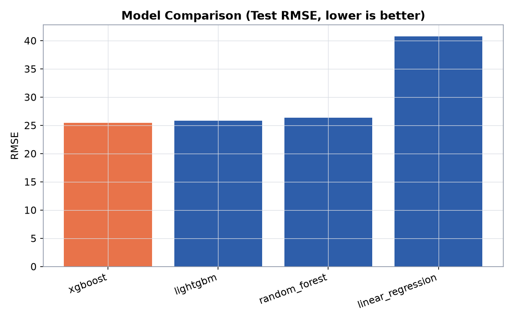
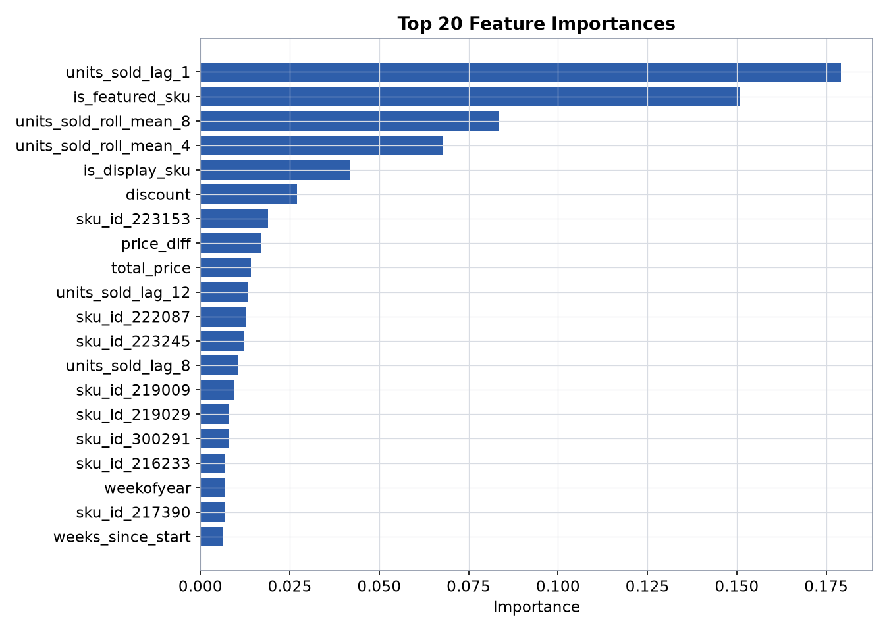
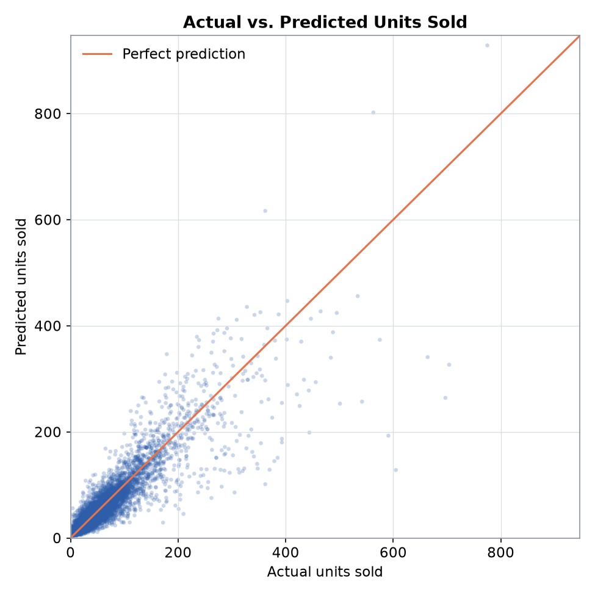
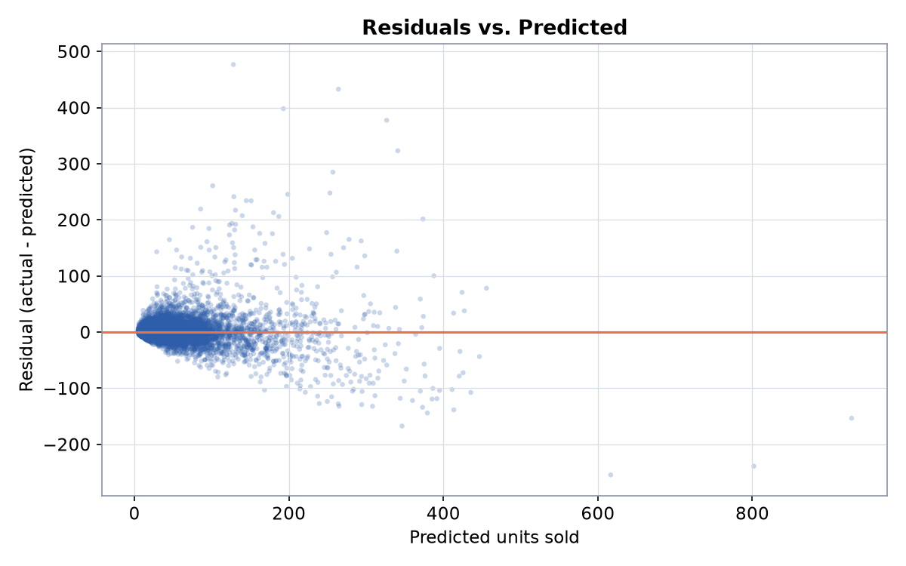

# SKU-Level Demand Forecasting

An end-to-end machine learning system that predicts next-week unit sales for
a given store/SKU combination, so retailers can plan inventory without
over- or under-stocking. Built as a from-scratch rebuild of a SmartBridge
internship proof-of-concept into a production-shaped pipeline: leakage-safe
time-series features, a compared and tuned set of regression models, a
FastAPI inference service, and a reproducible training/evaluation pipeline
backed by tests.

See [`PROJECT_REPORT.md`](PROJECT_REPORT.md) for exactly what changed from
the original internship version and why.

## Problem statement & business motivation

Retailers that don't know next week's demand for a SKU either overstock
(tied-up capital, markdowns, waste) or understock (lost sales, unhappy
customers). Given a store, a SKU, and next week's planned price/promotion
inputs, this project predicts expected units sold, using each series' own
recent sales history plus pricing and promotional signals.

## Dataset

[Kaggle: Demand Forecasting](https://www.kaggle.com/datasets/aswathrao/demand-forecasting) --
weekly sales for 76 stores x 28 SKUs (1,155 unique combinations), each with
exactly 130 consecutive weekly observations from 2011-01-17 to 2013-07-09
(a perfectly balanced panel). Columns: `week`, `store_id`, `sku_id`,
`total_price`, `base_price`, `is_featured_sku`, `is_display_sku`, and the
target `units_sold`.

Two data quirks worth knowing (both caught by
`src/data/validate.py` and asserted in `tests/test_dataset_invariants.py`):

- One row is missing `total_price`; it's imputed with `base_price`
  (assumes no discount was recorded for that row).
- There's a genuine 8-day gap in the calendar between 2012-02-27 and
  2012-03-06 -- a real anomaly in the source data, not missing rows.

`data/raw/test.csv` is the original Kaggle competition's unlabeled holdout
(no `units_sold`). It's kept for provenance only and is never used to
evaluate this project's model, since there's no ground truth to score it
against.

## Architecture

```
data/raw/train.csv
      |
      v
src/data/load.py, validate.py      (parse, impute, validate schema/panel)
      |
      v
src/features/build_features.py     (per-series lags/rolling stats, price
      |                              features, calendar features, one-hot)
      v
src/training/split.py              (time-based holdout + rolling-origin CV)
      |
      v
src/training/train.py              (RandomizedSearchCV over 4 model
      |                              candidates, log1p target)
      v
  +---+-------------------+
  |                        |
  v                        v
models/model.joblib   reports/metrics.md + reports/figures/*.png
models/metadata.json         (model comparison, plots)
  |
  v
app/inference.py + app/main.py     (FastAPI service, reuses the exact
                                     same feature pipeline as training)
```

## Repository layout

```
data/raw/            committed source CSVs
data/processed/      generated intermediate data (gitignored)
notebooks/           thin EDA notebook only -- no pipeline logic
src/
  data/              loading + validation
  features/          leakage-safe feature engineering (the core fix)
  models/            model registry + persistence/metadata contract
  training/          time-based split + the train.py orchestrator
  evaluation/        regression metrics (RMSE/MAE/R2/MAPE/WAPE)
  visualization/      plots + the metrics.md report generator
  utils/             config loading, logging
scripts/             one-off scripts (reference history builder)
app/                 FastAPI inference service
tests/               pytest suite (see TESTS.md)
reports/             generated evaluation report + figures
models/              trained model + metadata (committed, ~4MB)
configs/             train.yaml -- every pipeline parameter
docs/legacy/         the original internship notebook/PDF + what was fixed
```

## Installation

```bash
git clone https://github.com/xoBerlierxo/Estimation-Stock-Prediction.git
cd Estimation-Stock-Prediction
python -m venv .venv
source .venv/Scripts/activate    # Windows Git Bash; use .venv/bin/activate on macOS/Linux
pip install -e ".[dev]"
```

## Training

Every parameter (feature windows, split sizes, model search space, random
seed) lives in `configs/train.yaml`, so a run is fully reproducible from that
file plus the code at a given git commit (both are snapshotted into
`models/metadata.json`).

```bash
python -m src.training.train --config configs/train.yaml
```

This loads and validates the raw data, builds the feature matrix, splits
time-based (last 8 weeks held out), runs `RandomizedSearchCV` for each model
candidate using a 5-fold expanding-window (rolling-origin) CV scheme, picks
the best model by test RMSE, and writes `models/model.joblib` +
`models/metadata.json` + `reports/metrics.md` + `reports/figures/*.png`.

A full run trains 4 model candidates end to end; expect ~50 minutes on a
12-core machine (Random Forest's hyperparameter search dominates the
runtime -- see `PROJECT_REPORT.md` for the tradeoff made there). Pass
`--quick` for a fast smoke test with a trivial search budget (not meant to
produce reportable metrics).

## Evaluation & results

Full comparison table, figures, and metric caveats are generated at
`reports/metrics.md` and `reports/figures/`. Headline numbers from the
current committed model (held-out test set: the last 8 weeks, never touched
during model selection):

| model | RMSE | MAE | R² | WAPE |
|---|---|---|---|---|
| **xgboost (selected)** | **25.44** | **12.90** | **0.801** | **24.9%** |
| lightgbm | 25.81 | 13.03 | 0.795 | 25.2% |
| random_forest | 26.35 | 13.18 | 0.786 | 25.4% |
| linear_regression (baseline) | 40.75 | 17.21 | 0.489 | 33.2% |

XGBoost cuts RMSE by **37.6%** and roughly doubles R² versus the linear
baseline. See [`reports/metrics.md`](reports/metrics.md) for the full table
(including CV scores and best hyperparameters) and the MAPE-vs-WAPE caveat.

### Visualizations

| | |
|---|---|
|  |  |
|  |  |

## Running the API

```bash
uvicorn app.main:app --reload
```

Interactive docs at `http://127.0.0.1:8000/docs`. Example request:

```bash
curl -X POST http://127.0.0.1:8000/predict \
  -H "Content-Type: application/json" \
  -d '{
        "store_id": 8023, "sku_id": 216233, "week": "2013-07-16",
        "total_price": 130.0, "base_price": 140.0,
        "is_featured_sku": 1, "is_display_sku": 0
      }'
```

`GET /stores-skus` lists every valid `(store_id, sku_id)` combination and
each one's `next_predictable_week`, so you don't have to guess a valid
request.

### API limitations (v1, by design)

- **Next week only.** The service forecasts only the week immediately
  following the latest known history for a store/SKU -- no recursive
  multi-week-ahead forecasting, which would compound model error silently.
- **No cold start.** A `(store_id, sku_id)` combo not present in
  `app/data/reference_history.parquet` (built from the training data by
  `scripts/build_reference_history.py`) can't be scored.

### Docker

```bash
docker build -t sku-demand-forecasting .
docker run -p 8000:8000 sku-demand-forecasting
```

> The project's original Flask app was deployed on Render; that deployment
> used the old (buggy) pipeline and is not redeployed as part of this
> rebuild. See `docs/legacy/` for what it looked like.

## Testing

```bash
pytest                                                 # 41 tests
pytest --cov=src --cov=app --cov-report=term-missing   # with coverage
```

See [`TESTS.md`](TESTS.md) for what each test file covers and the latest
captured run.

## Code quality tooling

```bash
pre-commit install        # run black/isort/flake8 on every commit
black src app tests scripts
isort src app tests scripts
flake8 src app tests scripts
mypy src app
```

All of the above run in CI on every push/PR (`.github/workflows/ci.yml`).

## Future improvements

- Multi-week-ahead forecasting with explicit uncertainty growth per step.
- Per-series (not just global) error analysis to catch SKUs the model
  underserves.
- Quantile regression for inventory-safety-stock-style predictions instead
  of a single point estimate.
- Target/frequency encoding for `store_id`/`sku_id` as an alternative to
  one-hot, if the SKU/store catalog grows large enough that cardinality
  becomes a problem.

## Technologies used

Python, pandas, NumPy, scikit-learn, XGBoost, LightGBM, FastAPI, Pydantic,
Uvicorn, Docker, GitHub Actions, pytest, black, isort, flake8, mypy,
pre-commit.

## License

[MIT](LICENSE)
